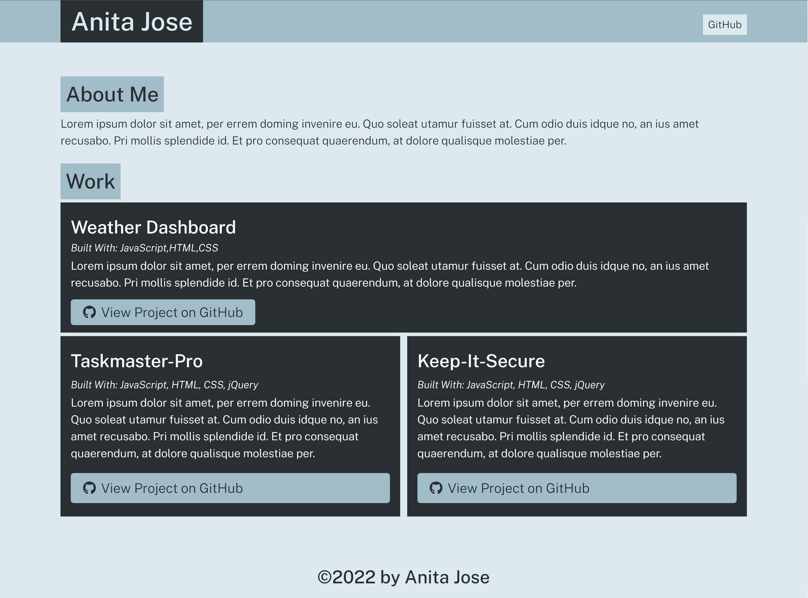

# Portfolio Generator

## Description

 The Portfolio Generator program dynamically creates an HTML portfolio page directly from the command line.
 
 Node.js is used to generate the portfolio using input that the user enters when prompted.

